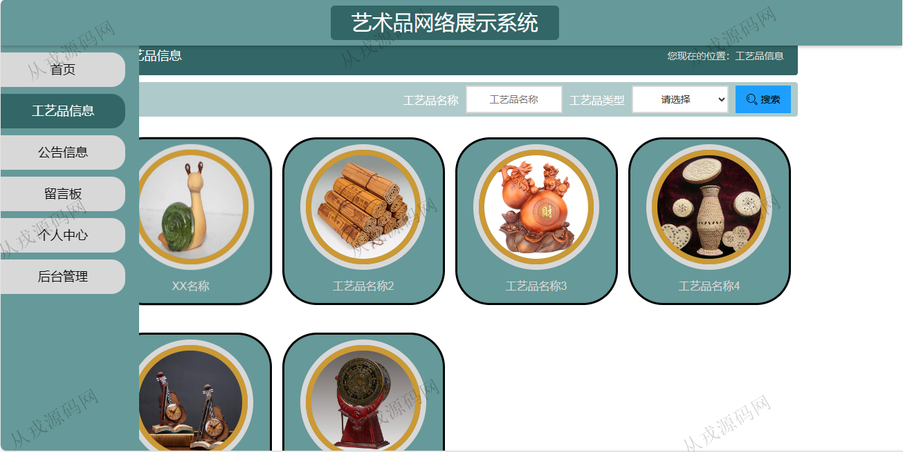
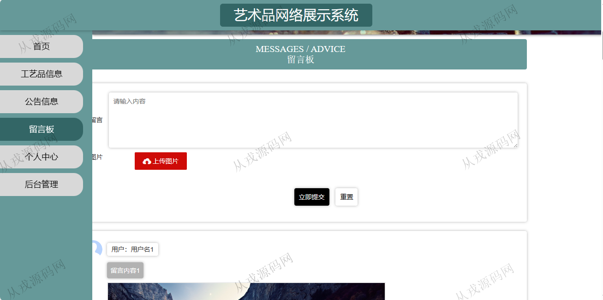
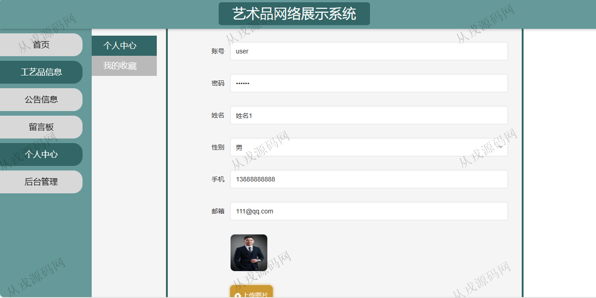
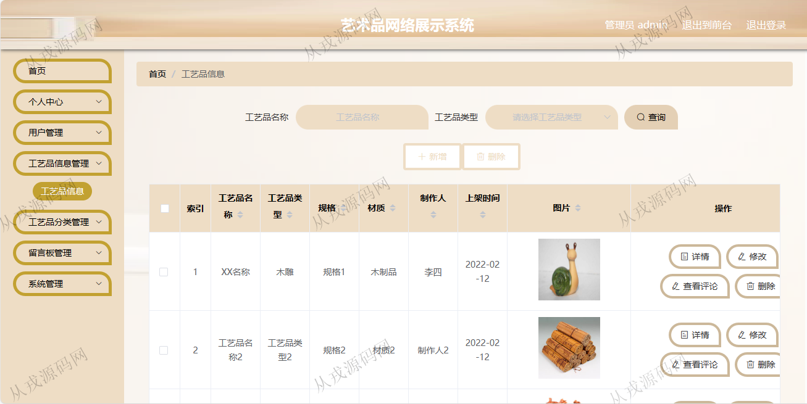
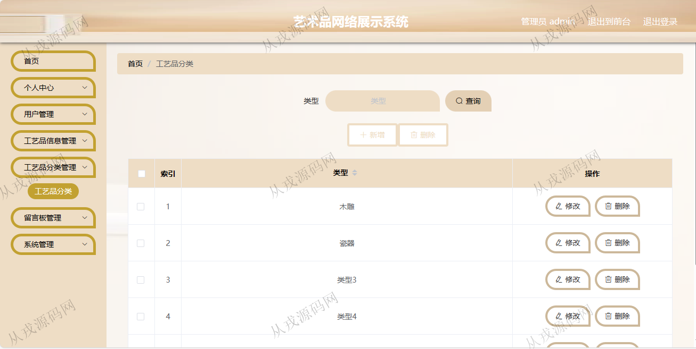
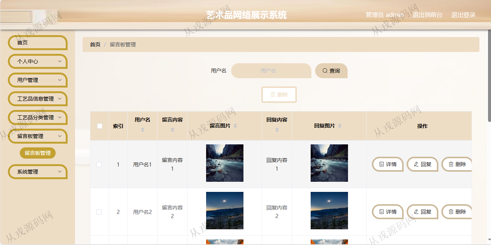
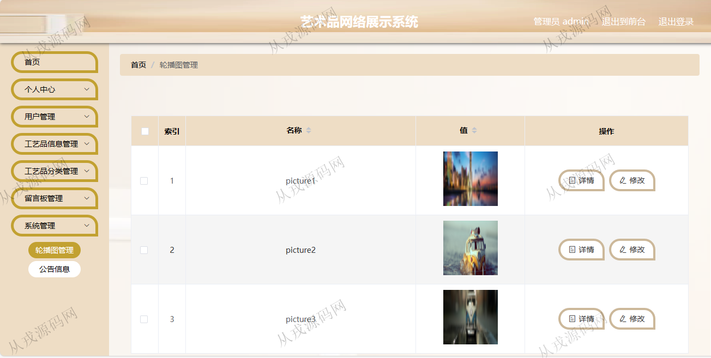

<h1 align="center">110.艺术品网络展示管理系统</h1>

 获取sql文件 QQ: 386869957 QQ群: 377586148 

 [推荐站点: 从戎源码网](https://armycodes.com/) 

## 简介

> 本代码来源于网络,仅供学习参考使用!
>
> 提供1.远程部署/2.修改代码/3.设计文档指导/4.框架代码讲解等服务
>
>访问路径
> 
> 用户端：http://localhost:8080/springbootq9413/front/index.html
>
> 用户: user 123456
> 
> 管理后台：http://localhost:8080/springbootq9413/admin/dist/index.html#/index
> 
> 管理员：admin 123456

## 项目介绍
基于springboot的艺术品网络展示管理系统：前端 vue、elementui，后端 maven，springmvc、spring、mybatisplus，角色分为管理员、用户；集成工艺品信息、公告信息、留言版等功能于一体的系统。

## 功能介绍

### 用户

- 基本功能：登录、注册，退出
- 网站首页：轮播图，公告信息
- 工艺品信息：分类导航，点我收藏，工艺品详情，赞一下，踩一下，发表评论
- 公告信息：公告列表展示，标题搜索，公告详情
- 留言板：留言列表展示，发表留言
- 个人中心：个人信息查看与修改，我的收藏列表

### 管理员

- 个人中心：密码修改，个人信息查看与修改
- 用户管理：用户信息的增删改查
- 工艺品信息：工艺品信息的增删改查，多条件查询，查看评论
- 工艺品分类管理：分类信息的增删改查
- 留言板管理：留言信息列表查询，详情，删除，回复
- 系统管理：轮播图的修改，详情，公告详情，修改，删除

## 环境

- <b>IntelliJ IDEA 2021.3</b>

- <b>Mysql 5.7.26</b>

- <b>Tomcat 7.0.73</b>

- <b>JDK 1.8</b>

## 运行截图

